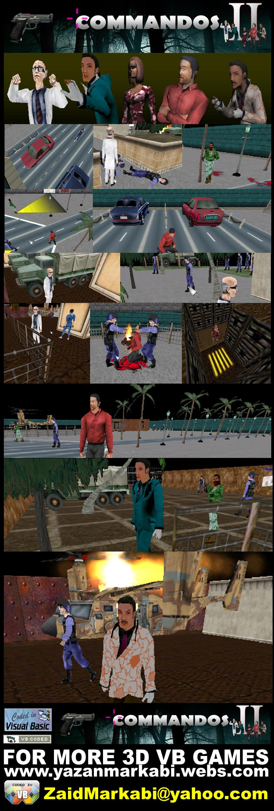



## Commandos2 \- 3d game

### Description

This demo was developed using Visual Basic 6 , DirectX7, DirectX8 TrueVision3D ...

COMMANDOS features include mesh animation, sizable viewport, true 3D sound,complex physics, fighter ai and more.
 
### More Info
 

             |
---                |---
**Submitted On**   |2009-05-27 13:36:42
**By**             |[Zaid Markabi](https://github.com/Planet-Source-Code/PSCIndex/blob/master/ByAuthor/zaid-markabi.md)
**Level**          |Advanced
**User Rating**    |5.0 (15 globes from 3 users)
**Compatibility**  |VB 5\.0, VB 6\.0
**Category**       |[DirectX](https://github.com/Planet-Source-Code/PSCIndex/blob/master/ByCategory/directx__1-44.md)
**World**          |[Visual Basic](https://github.com/Planet-Source-Code/PSCIndex/blob/master/ByWorld/visual-basic.md)
**Archive File**   |[Commandos22153405272009\.zip](https://github.com/Planet-Source-Code/zaid-markabi-commandos2-3d-game__1-72117/archive/master.zip)

